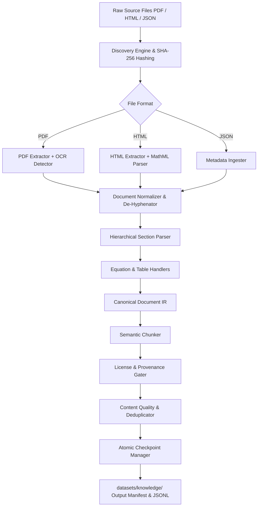

# Phase 3.3 — NPTEL & arXiv Knowledge Ingestion Engine Specification

## 1. Subsystem Purpose & Scope

The Knowledge Ingestion Engine (`src/ingestion/`) is responsible for discovering, extracting, structuring, cleaning, chunking, and cataloging heterogeneous scientific and educational source materials (NPTEL lecture notes, course modules, slides, and arXiv preprint papers in PDF, HTML, and JSON formats).

It transforms raw unstructured or semi-structured files into a canonical Intermediate Representation (IR) and structured, semantically chunked knowledge datasets without fabricating data, hallucinating OCR, or violating upstream licensing constraints.

---

## 2. Architecture & Data Flow



---

## 3. Intermediate Representation (IR) Specification

Every processed document conforms to the following schema:

```json
{
  "document_id": "sha256_hex_digest_of_raw_bytes",
  "metadata": {
    "title": "Document Title",
    "authors": ["Author 1", "Author 2"],
    "source": "nptel | arxiv | other",
    "source_type": "documentation | licensed_material | public_domain | unknown",
    "source_url": "https://...",
    "license": "CC-BY-NC-SA-4.0 | UNKNOWN",
    "license_status": "KNOWN | UNKNOWN | MISSING",
    "internal_only": true,
    "pages_total": 12,
    "ocr_required": false
  },
  "sections": [
    {
      "section_id": "doc_id:sec_0",
      "title": "1. Introduction",
      "section_type": "introduction | lecture | methodology | ...",
      "page_start": 1,
      "page_end": 2,
      "subsections": [],
      "paragraphs": ["Text paragraph 1..."],
      "equations": [
        {
          "equation_id": "eq_0",
          "latex": "\\nabla \\times \\mathbf{E} = -\\frac{\\partial \\mathbf{B}}{\\partial t}",
          "equation_type": "display"
        }
      ],
      "tables": [
        {
          "table_id": "tab_0",
          "headers": ["Parameter", "Value"],
          "rows": [["c", "3.0e8 m/s"]],
          "markdown": "| Parameter | Value |\n|---|---|\n| c | 3.0e8 m/s |"
        }
      ]
    }
  ],
  "references": []
}
```

---

## 4. Semantic Chunking Specification

- Respects document $\rightarrow$ section $\rightarrow$ subsection $\rightarrow$ paragraph boundaries.
- Keeps equations and tables tightly bound to their contextual text.
- Windowing constraints:
  - `min_chunk_tokens`: 100
  - `max_chunk_tokens`: 1024
  - `chunk_overlap`: 50
- Deterministic chunk identifier:
  `chunk_id = sha256(document_id + ":" + section_id + ":" + str(chunk_idx) + ":" + text)[:16]`

---

## 5. License Compliance & Rights Gating

1. Content with verified permissive licenses (`CC-BY-4.0`, `MIT`, `Apache-2.0`, `CC0`) is flagged with `internal_only: false`.
2. Content with restricted, non-commercial, or unverified licenses (`CC-BY-NC-SA`, `UNKNOWN`, `MISSING`) is automatically gated with `internal_only: true`.
3. Unverified data is strictly restricted from external publishing or third-party distribution.

---

## 6. Execution Safety & Reproducibility

- Untrusted input parsing: HTML and PDF parsing strictly strips executable scripts, forms, and embedded macros.
- Checkpointing: Real-time progress is committed to `checkpoint.json` atomically via temporary files and rename operations.
- CLI flags: `--resume`, `--force`, `--dry-run`, `--max-documents`, and `--workers` for deterministic and resilient execution.
